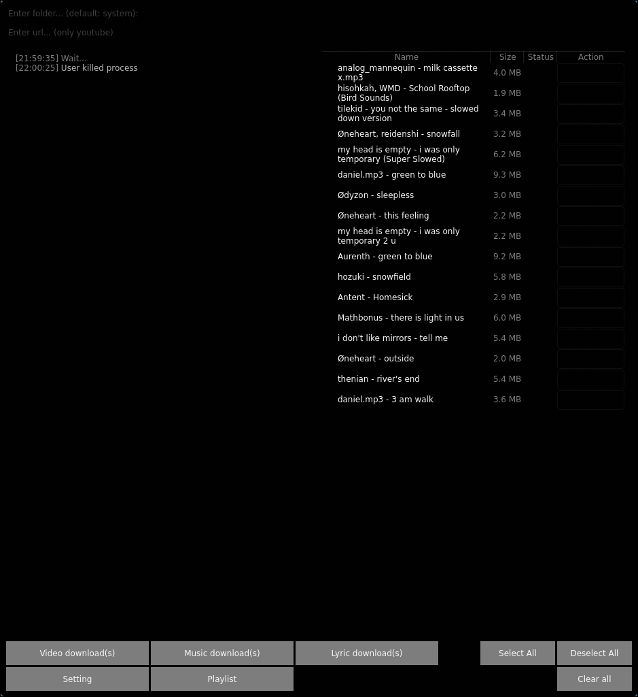
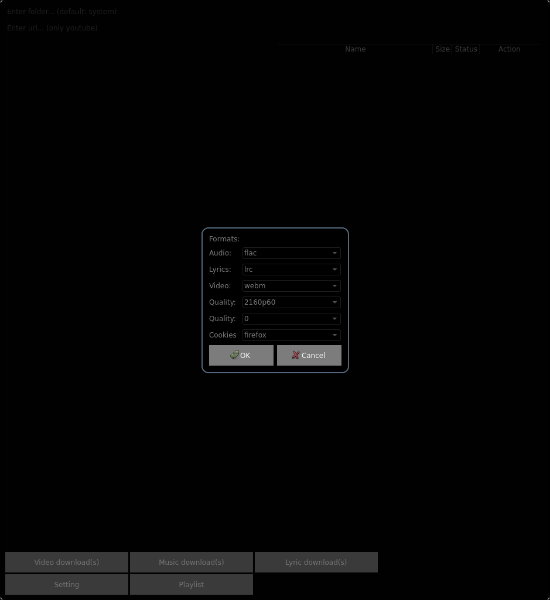
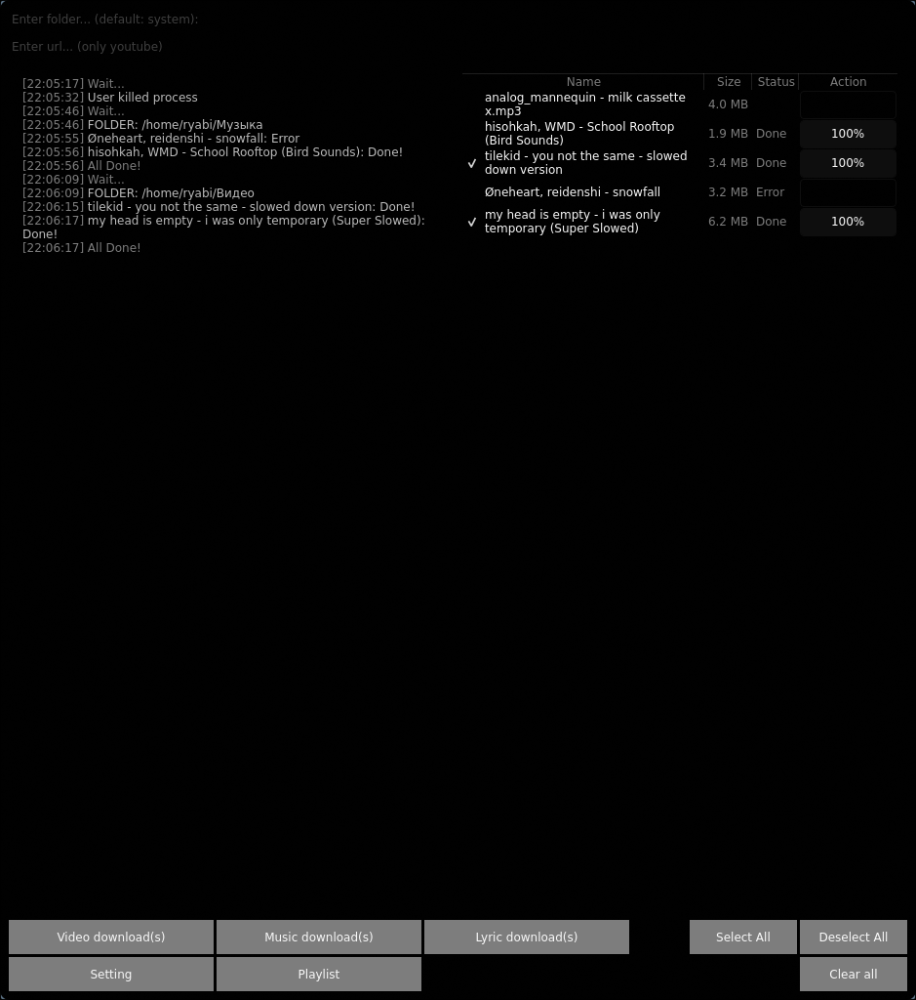

# getMusicApp

A modern, fast, and feature-rich desktop media downloader built with **C++** and the **Qt Framework**. It acts as a powerful graphical frontend for `yt-dlp`, allowing users to fetch, manage, and download multimedia content with ease.







## Key Features

*   **Multi-Format Downloading:** Native support for separate Video, Music, and Lyric downloading options.
*   **Batch Processing:** Queue up multiple links, manage them using "Select All" / "Deselect All", and clear your workspace with a single click.
*   **Real-time Log Terminal:** Built-in console logger that tracks paths, waiting states, download progress, and process completion status.
*   **Structured Download Table:** Clean UI grid showing file name, size, download status, and percentage completion.
*   **Path Customization & Playlist Management:** Dedicated settings module to change download directories (defaulting to system music folders) and manage playlist files.
*   **Cross-Platform Ready:** Designed primarily on Linux but fully compatible with Windows.

## Technical Stack

*   **Language:** C++
*   **Framework:** Qt Framework
*   **Core Backend:** `yt-dlp`, `syncedlyrics` and `FFmpeg` integration for reliable media extraction
*   **Environment:** Linux, Windows

## Downloads & Releases

You don't need to build the app from source to try it out. Ready-to-run binaries are available in the **Releases** section:

*   **Linux (Arch Linux / Ubuntu or Others):** Download the standalone AppImage or pre-compiled binary.
*   **Windows:** Portable `.zip` archive containing the `.exe` file and all necessary Qt libraries (compiled with MinGW).

 **[Download the latest release here](https://github.com/Ryeheck/getMusicApp)**

## How to Build and Run

### Prerequisites
You need a working C++ compiler, CMake, and Qt 6 (or Qt 5) installed on your system.

```bash
# Clone the repository
git clone https://github.com/Ryeheck/getMusicApp.git
cd getMusicApp

# Configure and Build
rm -rf build
cmake -B build -S .
cmake --build build

# Run the application
./build/getMusicApp
```
